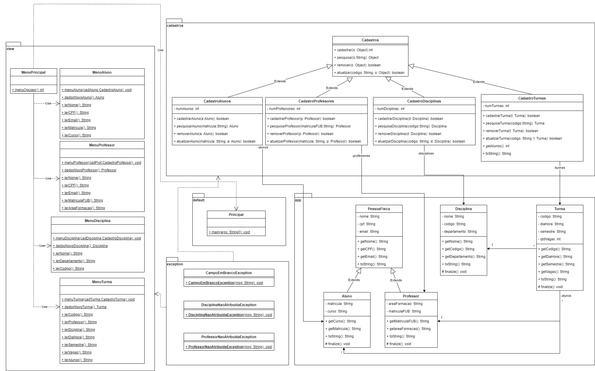

UnB - Universidade de Brasilia

FGA - Faculdade do Gama

OO - Orientação por Objetos

Prof. André Luiz Peron Martins Lanna

Alunos: 

Victor Leandro Rocha de Assis - 222021824
Matheus

# Trabalho Prático de Orientação por Objetos

## Introdução

Este projeto faz parte da disciplina de Orientação a Objetos e tem como objetivo desenvolver um sistema de cadastro acadêmico, que gerencia informações sobre alunos, professores, disciplinas e turmas.

## Objetivo

O objetivo deste trabalho prático é aplicar os conceitos fundamentais de Orientação por Objetos (OO), em especial os conceitos de Herança e Polimorfismo, no contexto de um sistema de gestão acadêmico. Utilizando o cenário descrito abaixo e o conjunto de classes presentes nesse diretório, os grupos de quatro alunos deverão implementar um sistema em Java que explore ao máximo os conceitos de Orientação por Objetos.

## Cenário

Um sistema de gestão acadêmica é responsável por realizar o cadastro de todos os elementos pertencentes ao domínio de uma universidade. Por exemplo, o sistema é responsável por cadastrar todos os alunos e professores, todas as disciplinas, todas as turmas de cada disciplina e, por fim, todas as salas de aulas.

Esse sistema deve também ser capaz de criar turmas para cada disciplina e, para cada turma, deve ser capaz de associar um professor e matricular os alunos, ambos já existentes no cadastro. Para cada turma, o sistema deverá ser capaz de imprimir a lista de presença que contenha, obrigatoriamente, o nome da disciplina, o nome do professor daquela turma, o código da turma e a lista de alunos (matrícula e nome) matriculados.

O sistema deverá ainda ser capaz de impedir o cadastro de elementos do domínio que tenham valores em branco para qualquer um de seus atributos. Nesses casos deverá lançar uma exceção do tipo "CampoEmBrancoException", em que na mensagem do objeto de exceção seja informado qual o campo que ficou em branco. Com relação às turmas, essas não poderão ser cadastradas se não tiver uma disciplina e/ou um professor associado. Nesses casos deverão ser lançadas as exceções "DisciplinaNaoAtribuidaException" e "ProfessorNaoAtribuidoException", respectivamente.

## Enunciado

O código presente no diretório já realiza o cadastro de Alunos mas sem tratar as exceções listadas no cenário descrito acima. Para o trabalho, faça o que se pede:
1. Implemente o lançamento e tratamento de exceções para o cadastro de alunos.
2. Implemente os cadastros faltantes (disciplinas, turmas e professores), em todas as suas operações:
    - cadastrar
    - pesquisar
    - alterar
    - remover
3. Para os novos cadastros, lance e trate as exceções listadas no cenário descrito acima.
4. Imprima a lista de presença para uma data turma pesquisada. Exemplo: ao informar o código "t1", o programa vai listar a lista de disciplinas da turma cadastrada com o código "t1".

## Diagrama de Classes



## Estrutura do Projeto

### Pacotes e Classes

- **app**: Pacote principal que contém as classes base do projeto.
  - `Principal`: Classe principal que contém o método `main`.
  - `PessoaFisica`: Classe base para `Aluno` e `Professor`.
  - `Aluno`: Classe que representa um aluno.
  - `Professor`: Classe que representa um professor.
  - `Disciplina`: Classe que representa uma disciplina.
  - `Turma`: Classe que representa uma turma.
- **cadastros**: Pacote que contém as classes de cadastro.
  - `Cadastros`: Classe base para as operações de cadastro.
  - `CadastroAlunos`: Classe que gerencia o cadastro de alunos.
  - `CadastroProfessores`: Classe que gerencia o cadastro de professores.
  - `CadastroDisciplinas`: Classe que gerencia o cadastro de disciplinas.
  - `CadastroTurmas`: Classe que gerencia o cadastro de turmas.
- **view**: Pacote que contém as classes de interface com o usuário.
  - `MenuPrincipal`: Classe que representa o menu principal.
  - `MenuAluno`: Classe que gerencia as opções do menu de aluno.
  - `MenuProfessor`: Classe que gerencia as opções do menu de professor.
  - `MenuDisciplina`: Classe que gerencia as opções do menu de disciplina.
  - `MenuTurma`: Classe que gerencia as opções do menu de turma.
- **exception**: Pacote que contém as classes de exceção.
  - `CampoEmBrancoException`: Classe para tratar exceções de campos em branco.
  - `DisciplinaNaoAtribuidaException`: Classe para tratar exceções de disciplinas não atribuídas.
  - `ProfessorNaoAtribuidoException`: Classe para tratar exceções de professores não atribuídos.

## Requisitos do Sistema

| ID   | Requisito                                                                                     | Descrição                                                                                                  |
|------|-----------------------------------------------------------------------------------------------|------------------------------------------------------------------------------------------------------------|
| R01  | Cadastro de Alunos                                                                            | O sistema deve permitir o cadastro de novos alunos com nome, CPF, email, matrícula e curso.                |
| R02  | Cadastro de Professores                                                                       | O sistema deve permitir o cadastro de novos professores com nome, CPF, email, área de formação e matrícula FUB. |
| R03  | Cadastro de Disciplinas                                                                       | O sistema deve permitir o cadastro de novas disciplinas com nome, código e departamento.                    |
| R04  | Cadastro de Turmas                                                                            | O sistema deve permitir o cadastro de novas turmas com código, dia/hora, semestre, vagas e professor.       |
| R05  | Pesquisa de Alunos                                                                            | O sistema deve permitir a pesquisa de alunos por matrícula.                                                |
| R06  | Pesquisa de Professores                                                                       | O sistema deve permitir a pesquisa de professores por matrícula FUB.                                       |
| R07  | Pesquisa de Disciplinas                                                                       | O sistema deve permitir a pesquisa de disciplinas por código.                                              |
| R08  | Pesquisa de Turmas                                                                            | O sistema deve permitir a pesquisa de turmas por código.                                                   |
| R09  | Atualização de Alunos                                                                         | O sistema deve permitir a atualização das informações de um aluno existente.                               |
| R10  | Atualização de Professores                                                                    | O sistema deve permitir a atualização das informações de um professor existente.                           |
| R11  | Atualização de Disciplinas                                                                    | O sistema deve permitir a atualização das informações de uma disciplina existente.                         |
| R12  | Atualização de Turmas                                                                         | O sistema deve permitir a atualização das informações de uma turma existente.                              |
| R13  | Remoção de Alunos                                                                             | O sistema deve permitir a remoção de um aluno existente.                                                   |
| R14  | Remoção de Professores                                                                        | O sistema deve permitir a remoção de um professor existente.                                               |
| R15  | Remoção de Disciplinas                                                                        | O sistema deve permitir a remoção de uma disciplina existente.                                             |
| R16  | Remoção de Turmas                                                                             | O sistema deve permitir a remoção de uma turma existente.                                                  |
| R17  | Associação de Alunos a Turmas                                                                 | O sistema deve permitir a associação de alunos a turmas.                                                   |
| R18  | Obtenção do Número de Alunos em uma Turma                                                     | O sistema deve permitir a obtenção do número de alunos associados a uma turma.                             |

## Como Executar

1. Clone o repositório.
   ```sh
   git clone [https://github.com/seu-usuario/nome-do-repositorio.git](https://github.com/Afrontoso/OO-CadastroUnB.git)
   ```
2. Navegue até o diretório do projeto.
   ```sh
   cd nome-do-repositorio
   ```
3. Compile o projeto.
   ```sh
   javac -d bin src/**/*.java
   ```
4. Execute o programa principal.
   ```sh
   java -cp bin app.Principal
   ```

## Como Contribuir

1. Faça um fork do projeto.
2. Crie uma branch para sua feature ou correção de bug (`git checkout -b feature/nova-feature`).
3. Commit suas mudanças (`git commit -am 'Adiciona nova feature'`).
4. Push para a branch (`git push origin feature/nova-feature`).
5. Abra um Pull Request.
